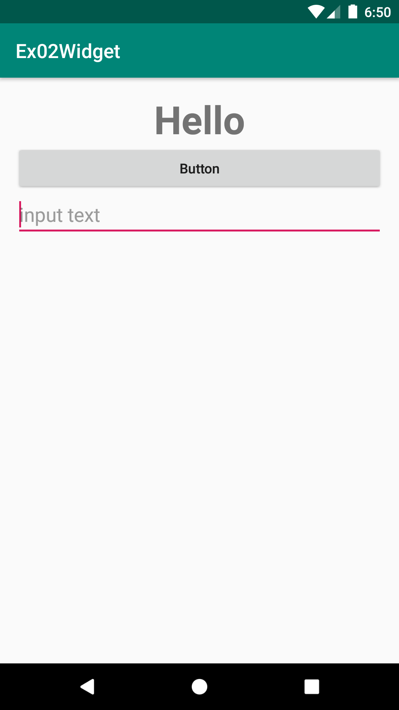
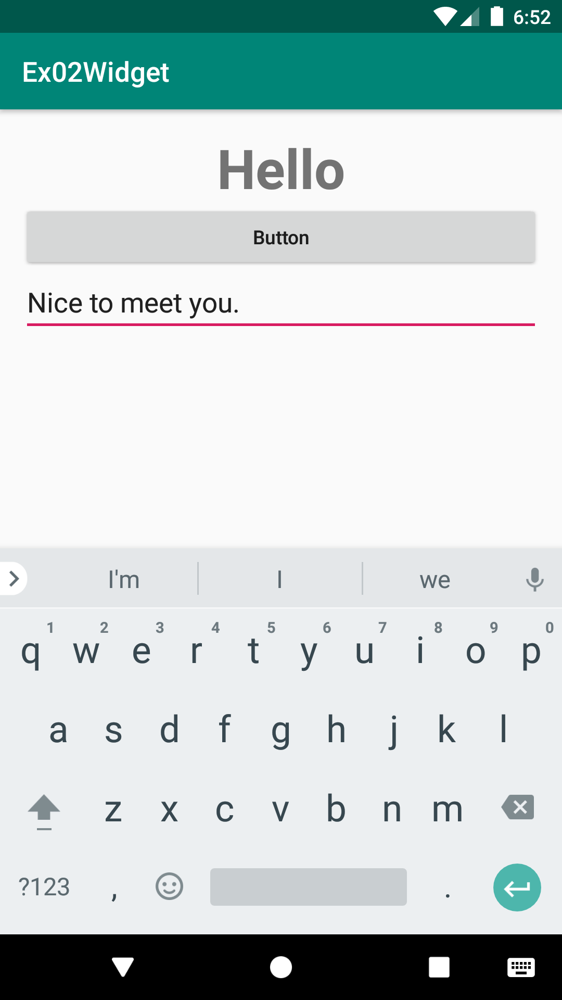
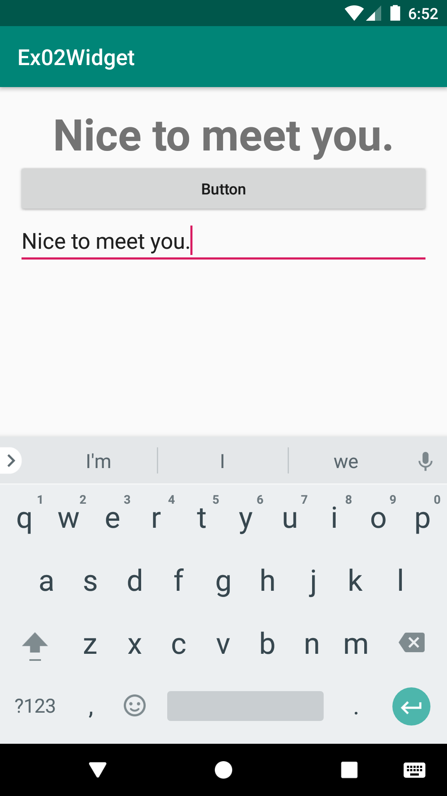
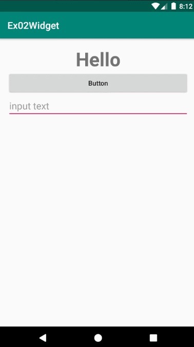

# Ex02Widget
안드로이드 네이티브 앱 개발 수업 예제#2

# 주요코드
Button 클릭 이벤트를 통해 TextView의 글씨변경 및 EditText를 통한 사용자 입력 

- res폴더>>layout폴더안에 있는 activity_main.xml문서를 수정하여 화면제작
- 버튼을 클릭하였을 때 사용자가 EditText를 통해 입력한 글씨를 얻어와서 TextView의 글씨를 변경해보기
- 안드로이드 이벤트처리 기법을 알아보는 예제로서 리스너객체에 대한 이해 및 활용

# 실행모습

  
  
  
  

